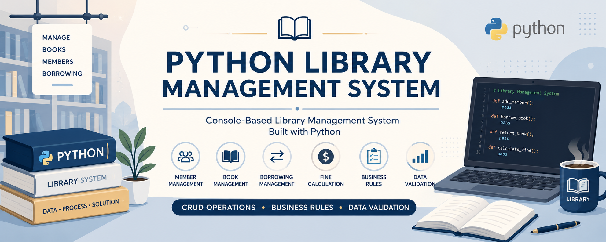
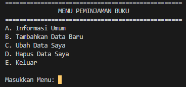
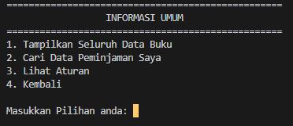
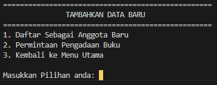
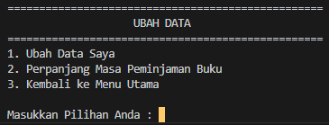
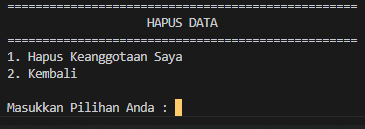

# 📚 Python Library Management System
Capstone Project 2 - Purwadhika (Business and Data Analyst) | Python Fundamentals | CRUD Application

> A console-based Library Management System developed using Python that implements CRUD operations, business rules, and borrowing validation to simulate a real-world library borrowing process.

<p align="center">

</p>

<p align="center">


</p>

## 📌 Project Overview
This project was developed as Capstone Project 2 to demonstrate the implementation of Python programming fundamentals.

Unlike a simple CRUD application, this system incorporates business rules commonly found in library management, including member registration, borrowing status validation, loan extension policies, overdue handling, and membership restrictions.
---

## 🎯 Objectives
### The objectives of this project are:
- Apply Python programming fundamentals.
- Implement CRUD operations using dictionaries.
- Practice modular programming using functions.
- Simulate real-world library borrowing scenarios.
- Implement business rules through program logic.

## ✨ Features
### A. General Information
- Display all borrowing records
- Search borrowing data by Member ID
- Display library borrowing rules

### B. Add New Data
- Register new library members
- Submit book procurement requests

### C. Update Data
- Update Member ID
- Update Member Name
- Update Phone Number
- Extend borrowing period
- Confirmation before saving changes

### D. Delete Data
- Delete member records
- Confirmation before deletion
- Borrowing status validation before deletion

## 🏛 Business Rules
### Borrowing Rules
- Borrowing period is **14 days**.
- One member may borrow one book at a time.
- Maximum loan extension is **7 days**.
- Books may be returned before the due date.

### Fine Rules
- Late return incurs a fine of **Rp10.000/day**.
- Maximum late period is **90 days**.
- Maximum fine is **Rp900.000**.

### Membership Rules
Members cannot extend borrowing if:
- Status = Returned
- Status = Not Borrowing
- Status = Overdue
- Status = Frozen

Members cannot be deleted if:
- Currently borrowing books
- Have overdue books
- Have unpaid fines
- Membership is frozen

Member IDs must be unique.

All update and delete operations require user confirmation.

## 📂 Project Structure
```text
python-library-management-system/

│
├── documentation/
│   ├── Flowchart Documentation
│   ├── Project Documentation
│   └── Flowchart Example
│
├── images/
│   ├── main-menu.png
│   ├── general-information.png
│   ├── add-new-data.png
│   ├── update-data.png
│   └── delete-data.png
│
├── library-management-system.py
├── README.md
├── LICENSE
└── .gitignore
```

## 🖥 Program Preview
### Main Menu

<p align="center">

</p>

### General Information

<p align="center">

</p>

### Add New Data

<p align="center">

</p>

### Update Data

<p align="center">

</p>

### Delete Data

<p align="center">

</p>

## 🔄 Program Flow

Main Menu
↓
General Information
↓
Member Registration
↓
Update Member Information
↓
Loan Extension
↓
Delete Member Data
↓
Exit

## 🚀 How to Run
Clone the repository

```bash
git clone https://github.com/Emmy-Analytics/python-library-management-system.git
```

Run the application

```bash
python library-management-system.py
```

## 🛠 Technologies Used
- Python
- Dictionary
- Functions
- Loops
- Conditional Statements
- CRUD Operations
- VS Code
- Git
- GitHub

# 📄 Documentation

### Flowchart Documentation
📄 [Flowchart Documentation](documentation/flowchart_documentation_library_management_system.docx)

### Project Documentation
📄 [Project Documentation](documentation/project-documentation.docx)

### Flowchart Example
📄 [Flowchart Example](documentation/flowchart-example.pdf)


## 👩 Author
**Emmy Jacklyn Pontoan**

Aspiring Business Data Analyst
Currently learning:

- Python
- SQL
- Excel
- Business Analytics
- Data Visualization

⭐ Thank you for visiting this repository.
